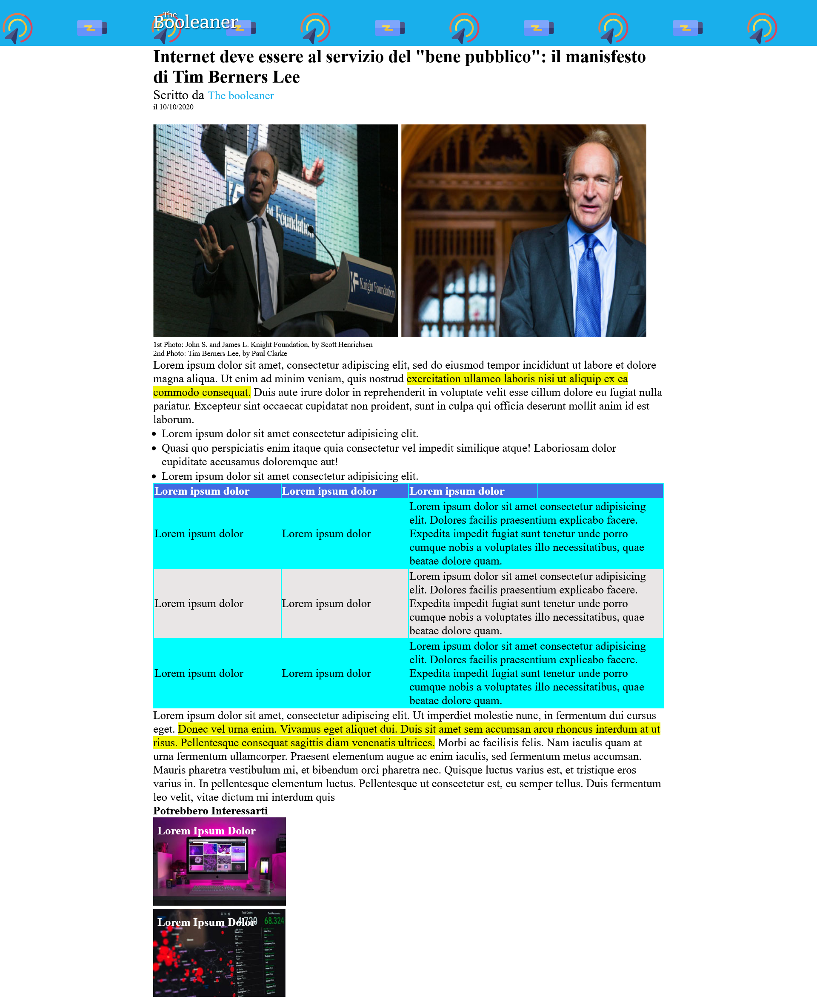

# html-css-booleaner


> **Breve descrizione:** Creazione di una pagina di giornale partendo dal layout presente nell'immagine in allegato, utilizzando HTML e CSS.

---

## 📚 Tecnologie utilizzate

**Linguaggi e tecnologie:**

- **HTML:** Linguaggio di markup per strutturare il contenuto.
- **CSS:** Linguaggio per definire lo stile e l'aspetto dei contenuti.

---

## 🎯 Obiettivi del progetto

📌 **Scopo principale:** Creare una web page a partire dall'immagine in allegato, utilizzando i tag base di HTML e manipolando lo stile della pagina con le proprietà CSS, per ottenere un risultato il più fedele possibile al layout proposto.
📌 **Competenze acquisite:**

- 🔹 UTilizzo dei Tag principali in html
- 🔹 Manipolazione delle proprietà CSS, quali `height`, `width`, `margin`, `padding` e `position`.

---

## Installazione e Avvio

Segui questi passaggi per installare e avviare il progetto:

```bash
# Clona il repository
git clone https://github.com/JoseManuel-Feliz/html-css-booleaner.git
# Entra nella cartella del progetto
cd html-css-booleaner
```

---

## 📸 Screenshot

## 

## 📁 Struttura del progetto

```plaintext
/html-css-booleaner
│-- css/
│-- img/
│-- README.md
│-- LICENSE
```

---

## Contributi

Vuoi contribuire a questo progetto? Segui questi passaggi:

1. **Fai un fork** del repository
2. **Crea un nuovo branch** con la tua modifica:
   ```bash
   git checkout -b feature/NuovaFunzionalità
   ```
3. **Effettua le modifiche** e fai il commit:
   ```bash
   git commit -m "Aggiunta nuova funzionalità"
   ```
4. **Esegui il push** sul tuo repository:
   ```bash
   git push origin feature/NuovaFunzionalità
   ```
5. **Apri una Pull Request** su GitHub.
   ✉️ **Nota:** Assicurati di seguire le [linee guida per le contribuzioni](CONTRIBUTING.md) se presenti.

---

## 📝 Issue e Bug

Se trovi un **bug** o hai un'idea per migliorare il progetto, apri un'**issue** nella sezione ["Issues"](https://github.com/JoseManuel-Feliz/html-css-booleaner/issues).
**Come segnalare un bug:**

1. Vai alla sezione **Issues** del repository.
2. Clicca su **New Issue**.
3. Descrivi il problema in modo dettagliato.
4. Se possibile, allega screenshot o log di errore.
   **Come proporre una nuova funzionalità:**
5. Vai alla sezione **Issues**.
6. Clicca su **New Issue**.
7. Seleziona **Feature Request**. _(Se non trovi questa opzione, crea comunque la issue e aggiungi manualmente l'etichetta `feature request` oppure indica nella descrizione che si tratta di una proposta di funzionalità.)_
8. Spiega il miglioramento proposto.

---

## 📜 Licenza

## Questo progetto è distribuito sotto licenza **MIT**. Vedi il file [`LICENSE`](LICENSE) per maggiori dettagli.

## Contatti

👤 **Jose Manuel Feliz**

- GitHub: [@JoseManuel-Feliz](https://github.com/JoseManuel-Feliz)
- LinkedIn: [Il Mio LinkedIn](https://linkedin.com/in/josemanuel-felizgarcia/)
- Email: [jmgarcia1718@gmail.com](mailto:jmgarcia1718@gmail.com)

---

❤️ **Creato con passione durante il bootcamp Boolean!**
